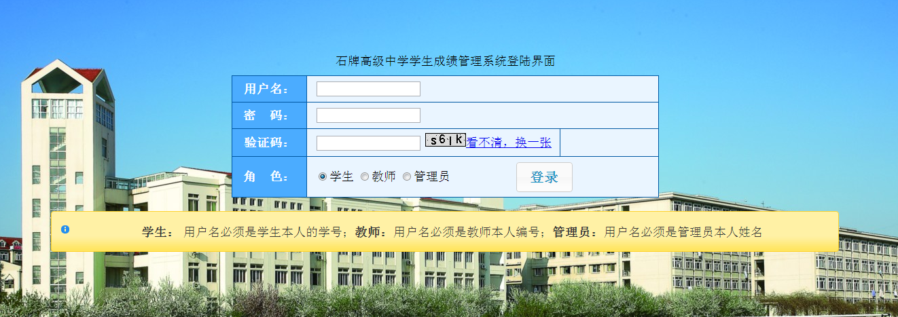
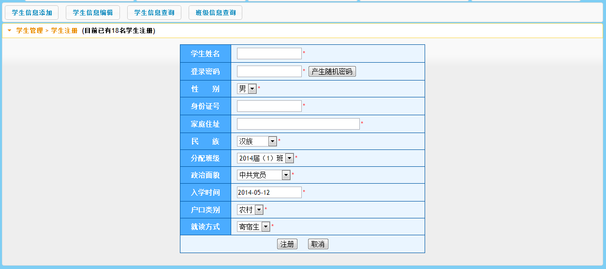
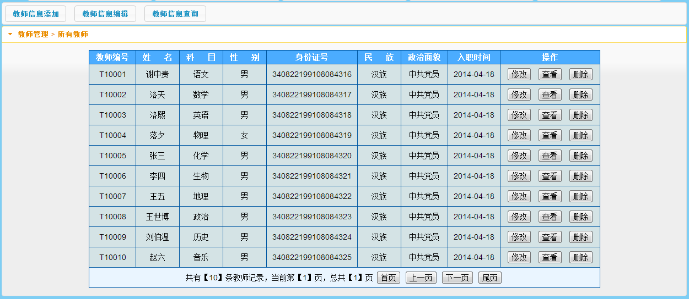
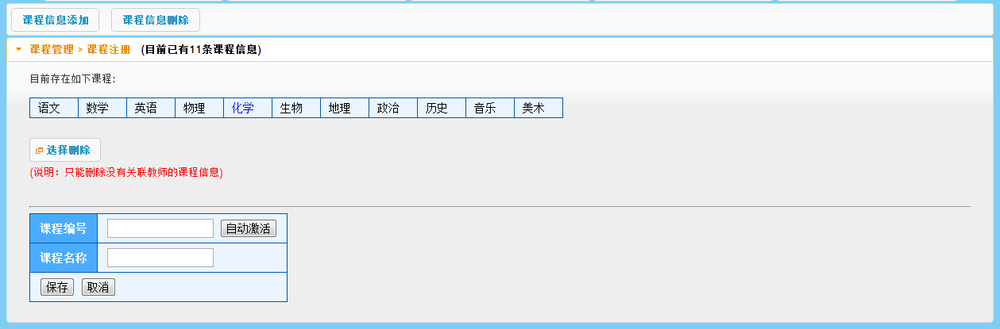
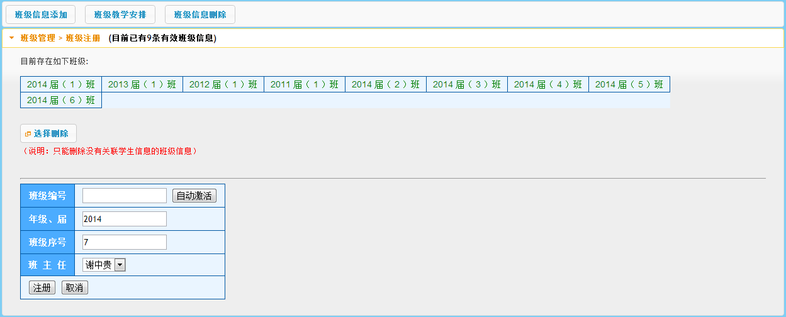
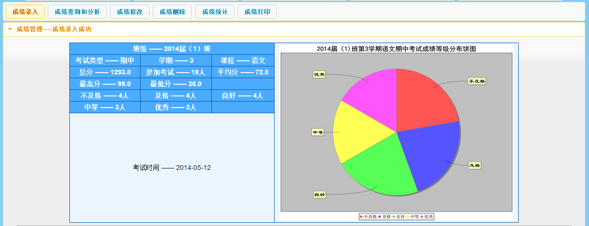
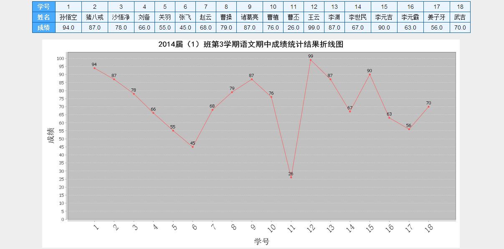

## 基于JSP实现的学生成绩管理分析系统

###  获取sql数据库文件: 从戎源码网 (https://armycodes.com/) QQ: 386869957 QQ群: 377586148
###  所有系统地址: (https://github.com/YuLin-Coder/AllProjectCatalog) 
###  所有项目以及源代码本人均调试运行无问题 可支持远程安装部署调试、定制修改、代码讲解

## 项目介绍
基于JSP实现的学生成绩管理分析系统，主要功能如下
【学生】
学生信息添加，学生信息编辑，学生信息查询，班级信息查询
【教师】
教师信息添加，教师信息编辑，教师信息查询，课程信息添加，课程信息删除，
【管理员】
班级信息添加，班级教学安排，班级信息删除，成绩录入，成绩查询和分析，成绩修改，成绩删除，成绩统计，成绩打印

## 项目技术
- 编程语言：Java
- 数据库：MySQL
- 前端技术：JSP、JavaScript
- 后端技术：spring、struts

## 运行环境
- JDK版本：JDK1.8及以上
- 开发工具：IDEA、Ecplise、Myecplise都可以
- 数据库: MySQL5.7及以上

## 运行截图

